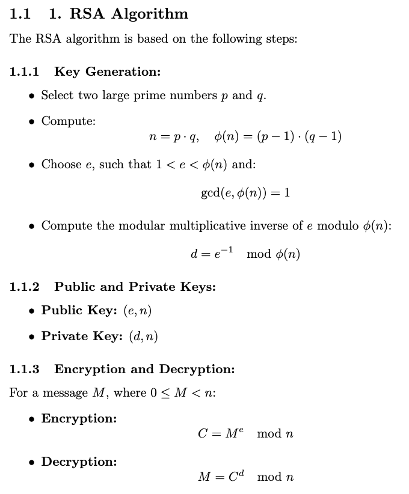
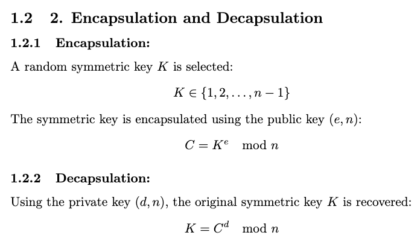
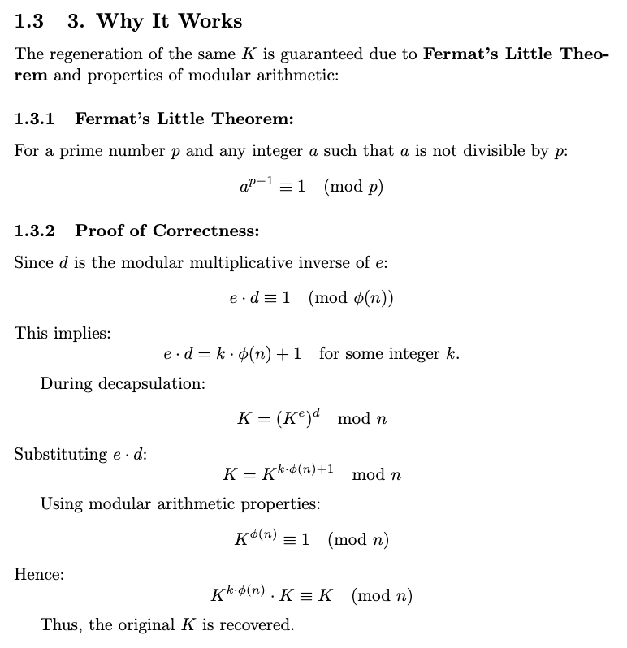

# **EncapRSA: Encapsulation and Decapsulation Framework Using RSA**

### Author: Soumyadev Saha

---

## **Overview**
**EncapRSA** is a secure RSA-based key exchange module that implements encapsulation and decapsulation of random symmetric keys. This library utilizes modular arithmetic and cryptographic hashing to ensure confidentiality and integrity of exchanged keys. The algorithm is robustly designed to hash public/private keys and encapsulated values, guaranteeing secure transmission of symmetric keys.

---

## **Key Features**
- RSA key generation with hashed public and private keys.
- Encapsulation of random symmetric keys using the hashed public key.
- Decapsulation of the same symmetric key using the hashed private key.
- Random seed initialization using a combination of salt and timestamp for randomness.

## **Mathematical Foundations**





---

## **Usage**

### **Key Generation**
```python
from EncapRSA import EncapRSA

ek, dk = EncapRSA.generate_keys(digits=10, salt="my_secure_salt")
```

### **Encapsulation**
```python
hashed_c, hashed_K = EncapRSA.encapsulate(ek, salt="my_secure_salt")
```

### **Decapsulation**
```python
hashed_K_decapsulated = EncapRSA.decapsulate(hashed_c, dk, salt="my_secure_salt")
```

---

## **Symmetric Key Exchange**

1. **Encapsulation**:
   - Generate a random symmetric key \( K \).
   - Encrypt \( K \) using the public key \( ek \) to produce the encapsulated value \( C \).

2. **Decapsulation**:
   - Recover \( K \) using the private key \( dk \).
   - Verify that the regenerated \( K \) matches the original.

---

### **Advantages**
- **Confidentiality**: Public and private keys, as well as the encapsulated values, are securely hashed.
- **Correctness**: Fermat's theorem ensures reliable key recovery.
- **Uniqueness**: The use of salt and timestamps ensures that random values are unique.

---

## **Example Output**

```plaintext
Hashed Public Key (ek): b23c9d8c3ab12f1...
Hashed Private Key (dk): a192dc8372b9e7...
Hashed Encapsulated Value (c): f45bc38129ac7d...
Hashed Original Random Value (K): e79fcb8318a2b7...

Decapsulation successful!
```
